# Project Master Plan: SignalCI (The "Trading Pipeline")

## 1. Executive Summary

**Product Name:** SignalCI (Internal Codename)

**Tagline:** "Stop trading noise. Automate your confirmation bias."

**Core Concept:** An app that treats trading signals like Software CI/CD pipelines. Instead of alerting immediately when a price crosses a line, the app triggers a "Pipeline" that verifies conditions over time.

**Value Prop:** Filters out "fake-outs" and "whipsaws" by enforcing patience programmatically.

---

## 2. Product Logic & Terminology

We use software engineering metaphors to validate trading ideas:

- **The Trigger:** Webhook from TradingView (e.g., "BTC > $95k").
- **Unit Test (Condition):** Instant check (e.g., "Is RSI < 70?").
- **Staging (Wait State):** A mandatory hold period (e.g., "Wait 10 minutes").
- **Integration Test (Correlation):** Checking external factors (e.g., "Did ETH also move?").
- **Production (Alert):** Only if all previous steps pass, send the Telegram notification.

---

## 3. UX/UI Design System ("FlowState")

**Design Philosophy:** "Scientific Instrument, not a Casino." Calm, precise, trustworthy.

### Color Palette

- **Primary (Brand):** Deep Teal (#0F766E) – Stability/Balance.
- **Success (Pass):** Soft Mint (#34D399) – "Safe to enter."
- **Wait (Holding):** Amber/Gold (#F59E0B) – "Pending validation."
- **Fail (Stop):** Burnt Coral (#F43F5E) – "Pipeline killed (Capital Protected)."
- **Background:** Ceramic White (#FAFAFA) or Gunmetal Dark (#1F2937).

### Platform Strategy

#### Web (The Architect):
- **Focus:** Building & Editing.
- **Key Interface:** React Flow canvas. Drag-and-drop nodes. Snap-to-grid. "Subway Map" visualization for connections.

#### Mobile (The Monitor):
- **Focus:** Status & Tuning. No complex graph editing.
- **Key Interface:** Card-based dashboard. Progress bars filling up as pipelines "wait." Large buttons to tune parameters (e.g., Change "10m wait" to "15m").

### Onboarding

- **Template Store:** Do not start with a blank canvas. Ask: "Are you a Sniper (Dip buyer) or Surfer (Trend follower)?" and load a pre-built pipeline.
- **Plain English Mode:** Toggle to switch `IF Price > MA(200)` to "Watch if Price is above Average."

---

## 4. Technical Architecture

**Architecture Style:** Event-Driven Serverless.

| Component | Technology | Role |
|-----------|-----------|------|
| Framework | Next.js 14+ | App Router, API Routes, Frontend. |
| Logic Engine | Inngest | Handles the "Wait" times, retries, and step-execution. Replaces legacy server loops. |
| Visuals | React Flow | The drag-and-drop canvas library. |
| Database | PostgreSQL (Supabase) | Stores Pipeline Configs and execution logs. |
| ORM | Prisma | Database access and schema management. |
| Styling | Tailwind + shadcn/ui | Rapid UI development. |

### 4.1 Master Architecture Diagram

This diagram represents the Single Source of Truth for the system architecture:

```mermaid
graph TD

    subgraph "Client Layer (UX Team)"

        User[("👤 Trader")]

        WebApp["🖥️ Web Dashboard<br/>(React Flow / Next.js)"]

        MobileApp["📱 Mobile Monitor<br/>(Read-Only View)"]

    end



    subgraph "The Edge (Security Team)"

        Firewall["🛡️ Cloudflare / WAF"]

        APIGateway["🚪 Next.js API Routes<br/>(Rate Limiting + Auth)"]

    end



    subgraph "The Brain (Inngest Engine)"

        Orchestrator["⚙️ Inngest Orchestrator<br/>(State Machine)"]

        WaitQueue[("⏳ Wait/Sleep Queue")]

        RetryLogic["🔄 Retry & Error Handling"]

    end



    subgraph "Data Persistence (Supabase)"

        DB[("🗄️ PostgreSQL<br/>(Pipeline Configs & Logs)")]

        Vault[("🔐 Supabase Vault<br/>(Encrypted API Keys)")]

    end



    subgraph "Integration Layer (Adapter Pattern)"

        IntManager["🔌 Integration Manager"]

         MetricAdapters["📈 Metric Adapters<br/>(CoinGecko, Binance, On-Chain)"]

         ActionAdapters["📢 Action Adapters<br/>(Telegram, Discord, Exchange)"]

    end



    %% Flows

    User -->|Builds Pipeline| WebApp

    User -->|Checks Status| MobileApp

    WebApp -->|Save Config| APIGateway

    MobileApp -->|Poll Status| APIGateway

    

    APIGateway -->|Auth Check| DB

    APIGateway -->|Trigger Event| Orchestrator

    

    Orchestrator -->|Read Config| DB

    Orchestrator -->|Get Keys| Vault

    Orchestrator -->|Sleep '10m'| WaitQueue

    

    Orchestrator -->|Execute Step| IntManager

    IntManager -->|Fetch Data| MetricAdapters

    IntManager -->|Send Alert| ActionAdapters

    

    MetricAdapters -->|HTTP GET| ExternalAPIs(("☁️ External Markets"))

    ActionAdapters -->|HTTP POST| ExternalUsers(("☁️ User Telegram"))
```



### 4.2 Strategic Constraints & Directives

#### Product & UX Constraints
- **Max Steps Limit:** Hard limit of 10 steps per pipeline (MVP constraint to prevent infinite loops and serverless budget drain)
- **No Infinite Loops:** React Flow UI must prevent circular connections that could create infinite execution loops

#### Security Directives
- **Key Rotation UI:** Users must have a "Revoke" button to instantly wipe API keys from Vault if compromised
- **Vault Integration:** All API keys stored in Supabase Vault (encrypted, never displayed in UI)

#### Integration Constraints
- **Read-Only Metrics Only (V1):** No auto-trade/execution adapters in V1
- **Notification Actions Only:** Telegram, Discord, and other notification channels are allowed
- **Auto-Trade is V2:** Exchange execution adapters are explicitly deferred to V2 due to liability concerns

---

## 5. Implementation Context (For AI Assistants)

# Role: Senior Architect for SignalCI

## Project Vision

We are building a "CI/CD for Trading." Users define pipelines that wait, check, and verify market conditions before alerting.

## Technology Stack

- **Frontend:** Next.js (App Router), React Flow, Tailwind CSS, shadcn/ui.
- **Backend:** Inngest (Event orchestration), Next.js API Routes.
- **Database:** Supabase (PostgreSQL), Prisma ORM.

## Architecture Guidelines

### 1. Separation of Concerns (CRITICAL)

- **Frontend (Visuals):** React Flow manages the UI `nodes` and `edges`. It does NOT run logic.
- **Transformer:** A specific utility function (`transformFlowToLogic.ts`) must exist to convert the messy React Flow JSON into a clean, linear "Step Configuration" for the backend.
- **Backend (Logic):** Inngest functions execute the logic based on the *clean* configuration, not the UI state.

### 2. The Inngest Workflow

- The main function `executePipeline` is triggered by an event `pipeline.triggered`.
- It performs `step.sleep()` for wait times (do not use `setTimeout`).
- It performs `step.run()` for API checks (Coingecko/Binance).
- It logs every step result to the database so the user can debug "Why did my trade fail?".

### 3. Data Schema (Prisma)

```prisma
model Pipeline {
  id           String   @id @default(uuid())
  userId       String
  name         String
  triggerToken String   @unique // Webhook slug
  flowConfig   Json     // UI State (React Flow)
  logicConfig  Json     // Execution State (Clean JSON)
  isActive     Boolean  @default(true)
  executions   Execution[]
}

model Execution {
  id          String   @id @default(uuid())
  pipelineId  String
  status      String   // PENDING, SUCCESS, FAILED
  logs        Json     // Array of step results
  createdAt   DateTime @default(now())
  pipeline    Pipeline @relation(fields: [pipelineId], references: [id])
}
```

### 4. Developer Rules

- Use zod for all data validation.
- Create modular "Nodes" in React Flow (e.g., WaitNode, ConditionNode).
- Ensure the Mobile view uses a different component (List/Card view) than the Web view (Canvas view).

---

## 6. Key Architectural Principles

### Data Flow

1. **User creates pipeline** → React Flow generates `flowConfig` (UI state)
2. **On save** → `transformFlowToLogic()` converts to `logicConfig` (execution state)
3. **Webhook triggers** → API route receives trigger, emits Inngest event
4. **Inngest executes** → Reads `logicConfig`, executes steps sequentially
5. **Results logged** → Each step result saved to `Execution.logs`

### Error Handling

- All condition evaluations must catch and log errors
- Failed conditions should not crash the pipeline
- Execution status should reflect partial success scenarios
- User should see clear error messages in execution logs

### Performance Considerations

- Cache API responses where possible (e.g., price data)
- Use Inngest's built-in retry mechanisms
- Rate limit external API calls
- Optimize React Flow rendering for large pipelines

### Security

- Validate all webhook inputs
- Sanitize user-provided conditions
- Encrypt sensitive API keys
- Implement rate limiting per user/pipeline

---

## 7. Component Structure

```
src/
├── app/                    # Next.js App Router
│   ├── api/
│   │   ├── webhook/        # Webhook trigger endpoints
│   │   └── pipelines/      # Pipeline CRUD operations
│   ├── builder/            # Visual pipeline builder (Web)
│   ├── dashboard/          # Pipeline list & status (Web)
│   └── pipelines/[id]/     # Individual pipeline view
├── components/
│   ├── editor/             # React Flow components
│   │   ├── PipelineEditor.tsx
│   │   ├── nodes/          # Node type components
│   │   └── NodeConfigPanel.tsx
│   └── ui/                 # shadcn/ui components
├── inngest/
│   ├── client.ts           # Inngest client setup
│   └── functions.ts        # Pipeline execution logic
├── lib/
│   ├── compiler.ts         # transformFlowToLogic()
│   ├── prisma.ts           # Prisma client
│   └── utils.ts            # Shared utilities
└── store/
    └── pipelineStore.ts    # State management
```

---

## 8. Development Workflow

### Adding a New Node Type

1. Create component in `components/editor/nodes/`
2. Add node type to `PipelineEditor` node types
3. Update `transformFlowToLogic()` to handle new node
4. Add execution logic in `inngest/functions.ts`
5. Update Prisma schema if new fields needed

### Adding a New Condition Type

1. Create evaluator function in `lib/conditions/`
2. Register in condition evaluation switch
3. Add UI controls in `ConditionNode.tsx`
4. Update validation schema (zod)

### Adding a New Action Type

1. Create handler function in `lib/actions/`
2. Register in action execution switch
3. Add UI controls in `ActionNode.tsx`
4. Update validation schema (zod)

---

## 9. Testing Strategy

### Unit Tests
- Condition evaluators
- Data transformers
- Validation schemas

### Integration Tests
- Pipeline execution end-to-end
- Webhook trigger → Inngest → Database
- API integrations (mocked)

### E2E Tests
- User creates pipeline
- Pipeline executes successfully
- Execution logs appear correctly

---

## 10. Deployment Considerations

### Environment Variables

```
DATABASE_URL=postgresql://...
INNGEST_EVENT_KEY=...
INNGEST_SIGNING_KEY=...
NEXT_PUBLIC_APP_URL=https://...
TELEGRAM_BOT_TOKEN=...
COINGECKO_API_KEY=...
```

### Build Process

1. Prisma generate
2. Next.js build
3. Inngest sync (deploy functions)

### Monitoring

- Inngest dashboard for function execution
- Vercel analytics for frontend
- Database query monitoring
- Error tracking (Sentry)

---

### 4.3 Execution Strategy & Squad Organization

To build this fast, engineering resources are split into two "Squads":

#### Squad A: "The Frontend Factory" (Focus: React Flow)
- **Goal:** Build the Canvas where JSON becomes Visual Nodes
- **Key Challenge:** Mobile responsiveness. The "Monitor View" needs to look like a simple list, not a squashed graph
- **Deliverables:**
  - React Flow canvas with node types (Trigger, Wait, Condition, Action)
  - Mobile-responsive list/card view for monitoring
  - Max 10 steps validation and visual indicators

#### Squad B: "The Pipeline Plumbers" (Focus: Inngest + Adapters)
- **Goal:** Build the `executePipeline` function that creates the state machine
- **Key Challenge:** Handling API failures. If CoinGecko is down for 5 seconds, we shouldn't fail the user's trade
- **Deliverables:**
  - Inngest workflow with retry logic (exponential backoff)
  - Integration adapters (Metric Adapters: CoinGecko, Binance read-only; Action Adapters: Telegram, Discord)
  - Execution logging for debugging

### 4.4 Risk Assessment

**Current Risk Level:** Low
- ✅ No auto-trading functionality (V1 is read-only)
- ✅ Max 10 steps prevents infinite loops
- ✅ Serverless architecture limits resource drain
- ✅ Tenant isolation prevents cross-user data leaks
- ✅ API keys encrypted in Supabase Vault

**V2 Considerations:**
- Auto-trade/Exchange execution adapters are explicitly deferred to V2 due to liability concerns
- If our code bugs out and buys 100 BTC, we are sued
- V1 focuses on Read-Only Metrics and Notification Actions only

---

**Last Updated:** 2025-01-25  
**Version:** 1.1 (Unified Architecture Strategy)  
**Status:** Active Development

